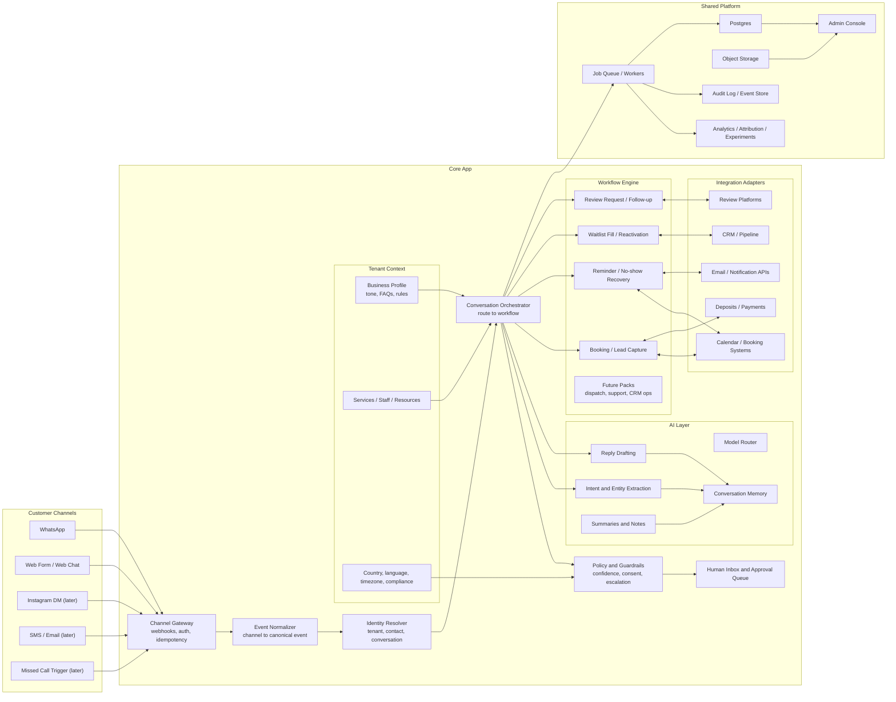
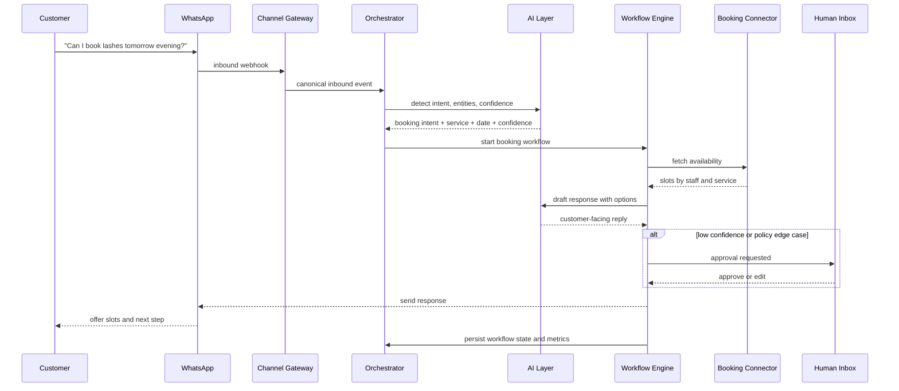
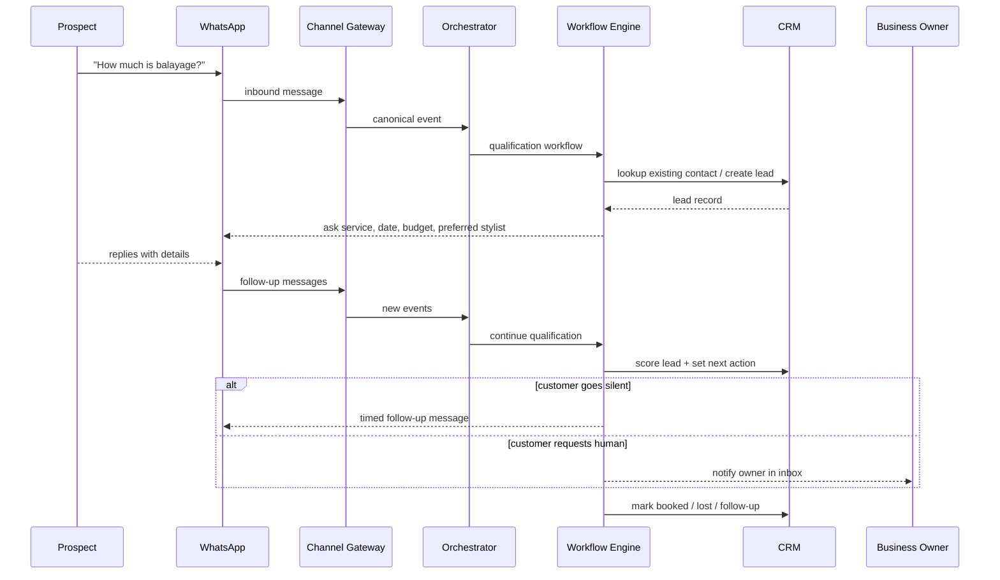
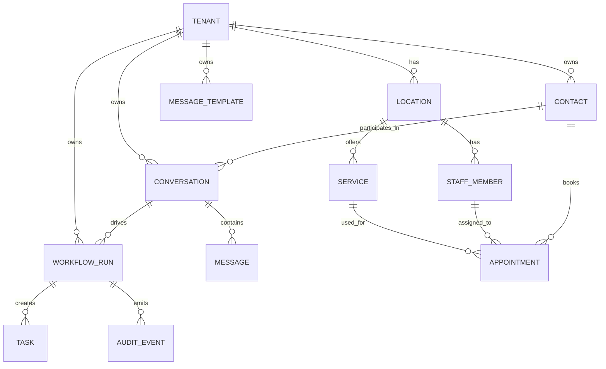

# WhatsApp AI Platform Architecture

## Goal

Build a multi-country, multi-vertical business workflow platform that starts with WhatsApp-first booking and lead recovery, but does not trap the product inside one niche or one channel.

Core principles:

- WhatsApp is the first channel, not the whole product.
- AI is a reasoning layer, not the source of truth.
- Workflow state, business rules, and compliance live outside prompts.
- Start as a modular monolith with hard internal boundaries.
- Add vertical packs and channel adapters without rewriting the core.

## Product Direction

V1 focus:

- Independent beauty professionals
- Small salons
- UK and UAE first
- WhatsApp-first booking, lead recovery, reminders, rescheduling

Long-term expansion:

- Clinics and med spas
- Home services
- Multi-location SMBs
- Other appointment and lead-based service businesses

## System Overview

## End-to-End Booking Flow

## End-to-End Lead Recovery Flow

## Layer Responsibilities

### 1. Channel Gateway

Responsibilities:

- Verify inbound webhooks
- Store raw channel payloads
- Enforce idempotency
- Convert provider-specific callbacks to a canonical event envelope

Do not put business logic here.

### 2. Event Normalizer

Responsibilities:

- Translate each channel payload into normalized objects
- Extract message text, attachments, sender, timestamps, and channel metadata
- Preserve raw payload for audit

Normalized objects:

- `InboundMessage`
- `OutboundMessage`
- `ContactEvent`
- `SystemEvent`

### 3. Identity Resolver

Responsibilities:

- Map phone/email/social identifiers to one contact
- Map contact to tenant
- Detect duplicate conversations
- Handle returning customers and shared inbox history

Core entities:

- `Tenant`
- `Contact`
- `Conversation`
- `ChannelAccount`
- `Lead`

### 4. Conversation Orchestrator

Responsibilities:

- Receive canonical events
- Route event to the correct workflow
- Load tenant context and compliance settings
- Call AI services only when needed
- Persist workflow state transitions

This is the control plane of the product.

### 5. Policy and Guardrails

Responsibilities:

- Consent rules by country and channel
- Quiet hours and timezone rules
- Low-confidence escalation
- Human approval for risky messages
- Role-based permissions

This layer protects the system from prompt mistakes.

### 6. AI Layer

Responsibilities:

- Intent classification
- Entity extraction
- Draft generation
- Conversation summarization
- Tone adaptation based on business profile

Do not let AI own:

- workflow state
- compliance decisions
- calendar truth
- payment truth

### 7. Workflow Engine

Responsibilities:

- Define state machines for business jobs
- Schedule reminders and retries
- Trigger follow-ups
- Apply business-specific rules
- Emit analytics events

Initial workflow packs:

- `booking`
- `lead-recovery`
- `reminder-reschedule`
- `waitlist-fill`
- `review-request`

Later workflow packs:

- `home-service-dispatch`
- `quote-follow-up`
- `support-triage`
- `reactivation-campaigns`

### 8. Tenant Context

Responsibilities:

- Business tone and voice
- Service catalog
- Staff and hours
- Deposits and cancellation policies
- Language preferences
- Country-specific messaging rules

This is the layer that makes the core reusable across industries.

### 9. Integration Adapters

Responsibilities:

- Read availability from calendars
- Create appointments
- Sync leads to CRM
- Create payment or deposit links
- Send email fallback
- Trigger review requests

Adapters should expose internal interfaces, not leak vendor-specific behavior into workflows.

## Expandability Strategy

### Horizontal expansion

Add new channels:

- Instagram DM
- SMS
- Email
- Web chat
- Voice / missed-call recovery

Because messages are normalized first, the workflow engine does not care where the lead started.

### Vertical expansion

Add new business packs:

- beauty
- clinics
- home services
- fitness
- education
- wellness

Each vertical pack should add:

- service schemas
- intake questions
- escalation rules
- playbooks

### Geographic expansion

Add country packs:

- consent rules
- approved template libraries
- timezone defaults
- language defaults
- data retention rules

Country behavior must be declarative, not hard-coded into handlers.

## Recommended V1 Scope

Build only these pieces first:

- WhatsApp inbound and outbound
- Tenant setup
- Contact and conversation history
- Booking workflow
- Reminder and reschedule workflow
- Human approval queue
- Basic analytics
- One calendar adapter

Do not build yet:

- multi-channel orchestration
- voice bot
- advanced CRM
- billing complexity
- multi-tenant white-labeling
- deep marketing automation

## Suggested Data Model

Core tables:

- `tenants`
- `locations`
- `contacts`
- `channel_accounts`
- `conversations`
- `messages`
- `workflow_runs`
- `tasks`
- `appointments`
- `services`
- `staff_members`
- `audit_events`
- `message_templates`
- `integrations`

## Internal Service Boundaries

Even inside one app, keep these modules separate:

- `channels`
- `identity`
- `orchestration`
- `policy`
- `ai`
- `workflows`
- `integrations`
- `analytics`
- `admin`

Rule:

- workflows may call integrations through interfaces
- channels may not call workflows directly without orchestration
- AI may not write authoritative state directly

## Recommended Tech Shape

Use a modular monolith:

- `Next.js` or `React` admin app
- `Node.js` or `TypeScript` backend
- `Postgres`
- `Redis` for queue and short-lived coordination
- background workers for reminders and retries
- provider adapters behind interfaces

This is enough for V1 to V3.

Do not split into microservices until:

- multiple teams exist
- queue load is meaningfully high
- isolated scaling actually matters

## Risks To Design Around

### 1. Provider lock-in

Mitigation:

- keep provider-specific code inside adapters
- do not let business rules depend on Twilio-specific payloads

### 2. Prompt drift

Mitigation:

- workflow state machine decides what happens next
- AI only proposes language or extracts data

### 3. Compliance by country

Mitigation:

- country packs
- explicit opt-in tracking
- quiet hours and template approvals

### 4. Low trust from businesses

Mitigation:

- approval queue
- audit log
- conversation summaries
- explainable workflow actions

### 5. Over-expansion too early

Mitigation:

- one vertical first
- one channel first
- one promised metric first

## Phase Plan

### Phase 1

- Independent beauty professionals
- WhatsApp-only
- Booking intake
- Confirmation
- Reminder
- Reschedule

Success metric:

- booked conversations
- reduced manual back-and-forth

### Phase 2

- Small salons
- staff and service routing
- waitlist fill
- no-show recovery
- deposits

Success metric:

- recovered bookings
- lower no-show rate

### Phase 3

- Clinics and med spas
- richer approval rules
- multilingual flows
- stronger analytics

### Phase 4

- Home services
- quote capture
- dispatch workflows
- image-based issue triage

## Final Design Rule

Build the product around this abstraction:

`A business workflow engine that happens to speak through WhatsApp first.`

If you keep that boundary clear, you can expand without rewriting the platform.
